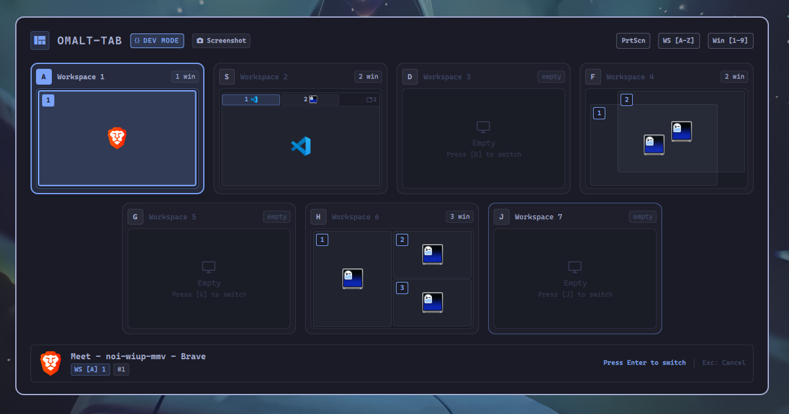
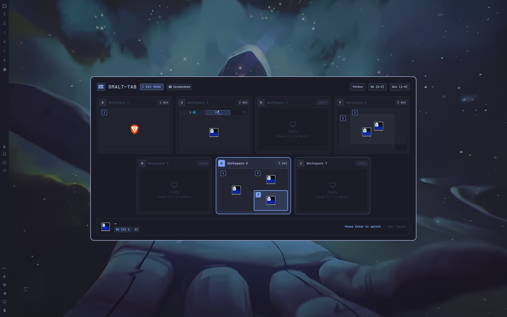

<div align="center">

# ❖ omalt-tab

**An ergonomic, race-condition-free Quickshell Alt+Tab window switcher with home-row workspace navigation and spatial miniature desktop layout for Omarchy & Hyprland.**

[](https://omarchy.org)
[](https://hyprland.org)
[](https://quickshell.outfoxxed.me)
[](LICENSE)
[](tests/test_logic.js)

<br/>

<p align="center">
  
</p>

*Spatial desktop switching in action — miniature workspace previews, home-row jumping, and real-time app outlines.*

[**Features**](#-highlights--why-omalt-tab) • [**Visual Tour**](#-visual-tour) • [**Controls**](#-controls--keymap) • [**Installation**](#-installation--setup) • [**Makefile Reference**](#-makefile-reference) • [**Architecture**](#-architecture)

</div>

---

## ✦ Highlights & Why omalt-tab?

Most Linux Wayland task switchers either blindly iterate windows in an unstructured linear strip or trigger frantic focus changes on each keystroke. **omalt-tab** re-engineers window switching from first principles:

- ⚡ **Atomic, Race-Condition-Free Focus**:
  Clients and workspaces are snapshotted **once** in RAM when the overlay opens. Cycling through tasks updates only internal selection states — Hyprland focus history is **never mutated mid-cycle**. Focus is dispatched atomically only when you release `Alt` (or press `Enter`).
- ⌨ **Home-Row Workspace Jumping (`A`–`;`)**:
  Skip tedious sequential cycling. Every workspace (`1` through `10`) is mapped straight across your keyboard's home row (`A`, `S`, `D`, `F`, `G`, `H`, `J`, `K`, `L`, `;`). Press one key to jump across your desktop instantly.
- 🔢 **Direct Window Focus Badges (`1`–`9`)**:
  Every window within each workspace card renders a distinct numbered badge. Hit `1`–`9` to immediately jump focus to that exact window without navigating.
- 🗂 **Miniature Desktop Spatial Previews**:
  Workspaces render miniature cards matching your display's true aspect ratio (16:9, 16:10, ultrawide). Window outlines reflect their genuine screen positions and sizes, with compensation for reserved top bars.
- 🌌 **Empty Workspace Traversal**:
  Unpopulated workspaces between active desktops are automatically detected and presented as cleanly styled empty cards. Jump to an empty desktop with a single keystroke and release `Alt` to land directly on it.
- 🎨 **Reactive Omarchy Theme Binding**:
  Inherits active palette colors (`Color.menu`, `Color.accent`, `Color.foreground`), background scrim dimming, active typography (`Style.font.*`), and corner rounding (`Style.cornerRadius`) on the fly.
- 🚀 **Sub-Millisecond UNIX Domain Socket**:
  Communicates over a dedicated socket (`$XDG_RUNTIME_DIR/omalt-tab.sock`) with automatic fallback to Omarchy shell IPC for instant response times.
- 🛠 **Zero-Dirty Git Developer Mode**:
  Developer mode toggles via a gitignored `.dev` flag file. Switch between development and production without dirtying tracked files or triggering git diffs.

---

## 📸 Visual Tour

### Miniature Spatial Workspace Layout
<p align="center">
  
</p>

- **Header Bar**: Displays active shortcut hints, jump keymaps, and dev badges.
- **Workspace Cards**: Scaled miniatures of each desktop containing proportional window outlines, high-res FreeDesktop application icons, and numbered badges (`1`–`9`).
- **Footer Bar**: Displays the currently focused window title, executable class name, and switching action.

### Full-Desktop Scrim Dimming
<p align="center">
  
</p>

*The background is gracefully dimmed with Omarchy's menu scrim, maintaining focus entirely on your task navigation.*

> 💡 **High-FPS Video**: A full 60fps recording is available at [`demo/demo.mp4`](demo/demo.mp4).

---

## 🎮 Controls & Keymap

### Primary Navigation

| Input | Action |
| :--- | :--- |
| <kbd>Alt</kbd> + <kbd>Tab</kbd> | Cycle next window in MRU (Most Recently Used) order |
| <kbd>Alt</kbd> + <kbd>Shift</kbd> + <kbd>Tab</kbd> | Cycle previous window in MRU order |
| **Release <kbd>Alt</kbd>** | **Commit selection and focus window immediately** |
| <kbd>Enter</kbd> / <kbd>Space</kbd> | Commit and focus selected window |
| <kbd>Esc</kbd> / Click outside | Cancel switcher without changing window focus |

### Direct Jumping (Home Row & Numbers)

| Key | Target |
| :---: | :--- |
| <kbd>A</kbd> | Jump to **Workspace 1** |
| <kbd>S</kbd> | Jump to **Workspace 2** |
| <kbd>D</kbd> | Jump to **Workspace 3** |
| <kbd>F</kbd> | Jump to **Workspace 4** |
| <kbd>G</kbd> | Jump to **Workspace 5** |
| <kbd>H</kbd> | Jump to **Workspace 6** |
| <kbd>J</kbd> | Jump to **Workspace 7** |
| <kbd>K</kbd> | Jump to **Workspace 8** |
| <kbd>L</kbd> | Jump to **Workspace 9** |
| <kbd>;</kbd> | Jump to **Workspace 10** |
| <kbd>1</kbd> – <kbd>9</kbd> | Select window index **1** through **9** in active workspace |

### Spatial & Cursor Navigation

| Input | Action |
| :--- | :--- |
| <kbd>←</kbd> / <kbd>→</kbd> | Spatial navigation left / right across adjacent windows and workspaces |
| <kbd>↑</kbd> / <kbd>↓</kbd> | Spatial navigation up / down across vertically stacked windows |
| <kbd>Home</kbd> / <kbd>End</kbd> | Jump to first / last window in the MRU sequence |
| **Left Click Window** | Immediately focus and switch to clicked window |
| **Left Click Workspace** | Immediately jump to clicked workspace |

---

## 📦 Installation & Setup

### Method 1: Native Omarchy Plugin Manager (Recommended)

Install and enable `omalt-tab` directly from git:

```sh
omarchy plugin add https://github.com/codesmith28/omalt-tab.git --enable
```

### Method 2: Local Developer Setup (`make dev`)

For development, testing, or customizing:

```sh
git clone https://github.com/codesmith28/omalt-tab.git ~/Projects/omalt-tab
cd ~/Projects/omalt-tab
make dev
```

`make dev` sets up:
1. A development symlink in `~/.config/omarchy/plugins/io.github.codesmith28.omalt-tab`.
2. A gitignored `.dev` flag that enables **Dev Mode** (switcher stays open after releasing `Alt`, requiring `Enter` to switch, and showing the header `DEV` badge).
3. Automatic Hyprland client binary symlinks and binding loader integration.

### Method 3: Clean Production Installation (`make prod`)

To install or restore standard release-to-switch behavior:

```sh
make prod
```

### Remove

To fully uninstall `omalt-tab`, including Hyprland keybindings and helper symlinks:

```sh
omarchy plugin remove io.github.codesmith28.omalt-tab
```

Or from the project directory for a complete cleanup (uses `omarchy plugin remove` under the hood):

```sh
make uninstall
```

---

## ⚙ Hyprland Keybindings Setup

Plugins in Omarchy live in `~/.config/omarchy/plugins/`. Ensure your `~/.config/hypr/bindings.lua` includes the plugin loader:

### Option A: Automatic Plugin Loader (Recommended)
Automatically loads `bindings.lua` from all installed Omarchy plugins:

```lua
-- Auto-load keybindings from installed Omarchy plugins (~/.config/omarchy/plugins/*/hypr/bindings.lua)
local plugins_dir = os.getenv("HOME") .. "/.config/omarchy/plugins"
local p = io.popen("find " .. plugins_dir .. " -maxdepth 3 -name 'bindings.lua' 2>/dev/null")
if p then
  for file in p:lines() do
    dofile(file)
  end
  p:close()
end
```

### Option B: Explicit omalt-tab Loader
Source `omalt-tab` specifically from its installed directory:

```lua
local omalt_tab = os.getenv("HOME") .. "/.config/omarchy/plugins/io.github.codesmith28.omalt-tab/hypr/bindings.lua"
local f = io.open(omalt_tab, "r")
if f then
  f:close()
  dofile(omalt_tab)
end
```

---

## 🛠 Makefile Reference

`omalt-tab` includes a comprehensive Makefile for lifecycle management:

| Command | Action |
| :--- | :--- |
| `make dev` | Links project into Omarchy plugins, enables `.dev` mode, and reloads shell |
| `make prod` | Installs clean copy in standard production mode (release `Alt` to switch) |
| `make mode-dev` | Enables Dev Mode flag (`.dev`, gitignored) without touching tracked files |
| `make mode-prod` | Removes `.dev` flag file, restoring production mode |
| `make status` | Displays active mode, installation symlink state, socket status, and Hyprland bindings |
| `make test` | Executes automated Node.js unit tests for model, spatial logic, and navigation |
| `make validate` | Runs unit tests, manifest validation, client bash syntax, and lua syntax checks |
| `make restart` | Restarts Omarchy shell and reloads Hyprland bindings |
| `make update` | Syncs latest code changes and reloads the active environment |
| `make clean-legacy` | Detects and cleans up obsolete `hyprswitch` services or autostarts |
| `make uninstall` | Runs `omarchy plugin remove`, cleans Hyprland bindings, and removes helper symlinks |

---

## 🏗 Architecture & Responsibilities

The codebase follows a clean separation of concerns across presentation, core algorithms, compositor integration, and testing:

```
omalt-tab/
├── components/          # Modular QML visual presentation layer
├── js/                  # Decoupled navigation math, model parser, & icon resolver
├── hypr/                # Hyprland keybinding submaps & IPC client script
├── tests/               # Automated regression and logic unit tests
├── demo/                # Showcase recordings and high-resolution media
├── AltTabOverlay.qml    # Main shell overlay entry point & IPC coordinator
└── manifest.json        # Omarchy plugin manifest contract
```

### Directory Breakdown

- **`components/` (Presentation Layer)**:
  Modular QML components handling all UI layout and styling. Houses miniature desktop cards (`WorkspaceCard`), proportional window tiles with selection glow (`WindowTile`), shortcut hint headers (`HeaderBar`), and window metadata footers (`FooterBar`).

- **`js/` (Core Logic Engine)**:
  Framework-agnostic JavaScript business logic decoupled from Qt Quick. Responsible for window geometry scaling with top menu bar compensation (`WindowModel`), 2D spatial navigation and MRU cycler (`Navigation`), FreeDesktop / PWA icon candidate resolution (`Icons`), and central configuration defaults (`Config`).

- **`hypr/` (Compositor Integration)**:
  Native compositor hooks and IPC dispatching. Contains the Hyprland keybinding submap configuration with atomic Alt-release watcher (`bindings.lua`) and the sub-millisecond UNIX domain socket client (`omalt-tab-client`).

- **`tests/` (Verification Suite)**:
  Automated Node.js regression test suite (`test_logic.js`) validating coordinate normalization math, spatial traversal algorithms, empty workspace handling, icon resolution fallbacks, and dev flag logic.

- **`demo/` (Showcase Media)**:
  High-resolution media assets including the lossless showcase animation (`demo.gif`), 60fps raw video capture (`demo.mp4`), and desktop screenshots.

---

## 🧪 Automated Testing

All core snapshot parsing, empty workspace detection, home-row jumping, spatial navigation, and icon resolution algorithms are rigorously unit-tested:

```sh
make test
```

To run the full validation suite (manifest validation, syntax checks, tests):

```sh
make validate
```

---

## 📄 License

Distributed under the [Apache-2.0 License](LICENSE).  
Created and maintained by **Sarthak Siddhpura**.
